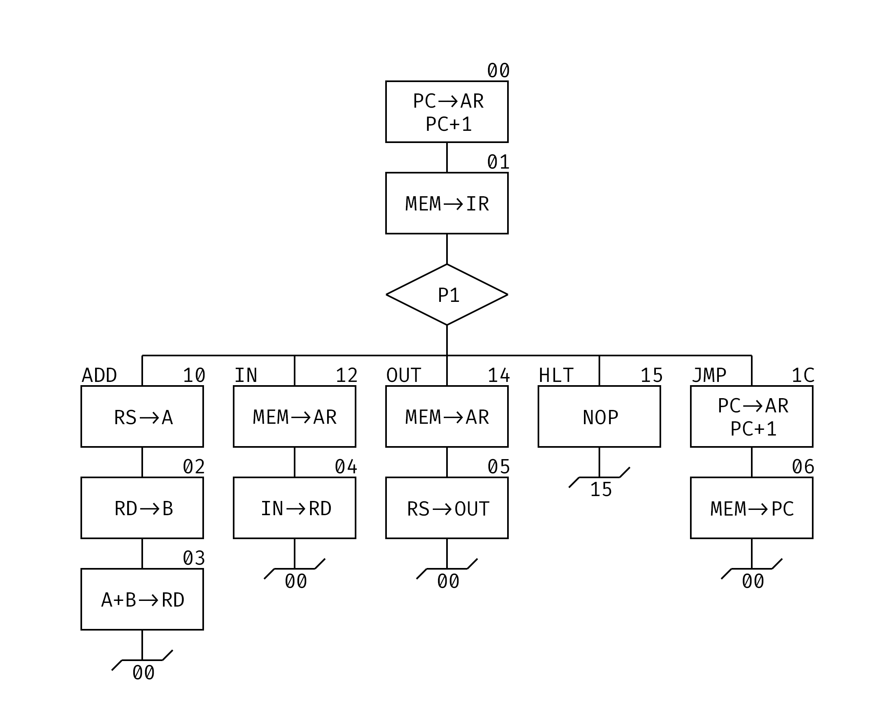

# TD-CMAKit

> 磨刀不误砍柴工

2020/2021(2) 计算机组成原理 TD-CMA 指令微指令相关工具

目前实现

- 微指令的汇编器，并推测指令格式信息
- 根据微指令生成流程图
- 根据推测信息进行汇编
- 可生成二进制源码映射表
- 自动微指令寄存器地址分配

## Usage

因为程序输出后并不会暂停，所以请在终端中打开以便取得输出结果。

启动程序后首先输入微指令汇编内容文件的路径，程序会输出伪微指令、指令提示和伪指令的二进制格式内容，并在微指令汇编内容文件目录下生成同名的微指令流程图图片，然后输入汇编内容文件的路径，程序会输出指令的二进制格式内容。

## 例子

### 微指令汇编

```
.START!:
	AR=PC++
	IR=MEM
	<P1>
		0:ADD
		2:IN
		4:OUT
		5:HLT
		C:JMP

.ADD#:
	A=RS
	B=RD
	RD=A+B
	END

.IN#:
	AR=MEM
	RD=IN
	END

.OUT#:
	AR=MEM
	OUT=RS
	END

.HLT#:
	NOP
	GOTO HLT

.JMP#:
	AR=PC++
	PC=MEM
	END
```

START 是程序处理的入口

标号后 ! 号表示此为读取下一指令的入口（必须有且只能有一个），END 等于 GOTO 至此

需要在标号后添加 # 指示程序这是一条指令

测试分支的位置可以自行指定也可由程序自动分配，若指定则可以是 `<P1:30>`

### 伪微指令

```
00 LDAR PC_B LDPC 01
01 LDIR RD P1 10
02 LDB RD_B 03
03 LDRi ADD ALU_B 00
04 LDRi RD IOM 00
05 WR IOM RS_B 00
06 LOAD LDPC RD 00
10 LDA RS_B 02
12 LDAR RD 04
14 LDAR RD 05
15 NOP 15
1C LDAR PC_B LDPC 06
```

### 二进制

```
$M 00 006D41 ; AR=PC++
$M 01 107050 ; IR=MEM
$M 02 002603 ; B=RD
$M 03 04B200 ; RD=A+B
$M 04 183000 ; RD=IN
$M 05 280400 ; OUT=RS
$M 06 105140 ; PC=MEM
$M 10 001402 ; A=RS
$M 12 106004 ; AR=MEM
$M 14 106005 ; AR=MEM
$M 15 000015 ; NOP
$M 1C 006D46 ; AR=PC++
```

### 根据微指令给出的指令提示
```
ADD: Mode 0 0000RSRD, 1 bytes.
IN: Mode 0 0010XXRD, 1 bytes.
OUT: Mode 0 0100RSXX, 1 bytes.
HLT: Mode 0 0101XXXX, 1 bytes.
JMP: Mode 0 11XX00XX, 2 bytes.
```

### 微指令流程图



### 汇编

```
.START:
    IN R1
    OUT R1
    JMP START
```

程序根据从上到下的顺序处理代码

汇编参数顺序：先 RD，再 RS，最后依次的附加字节

### 二进制

```
$P 00 21 ; IN R1
$P 01 44 ; OUT R1
$P 02 C0 ; JMP START
$P 03 00
```